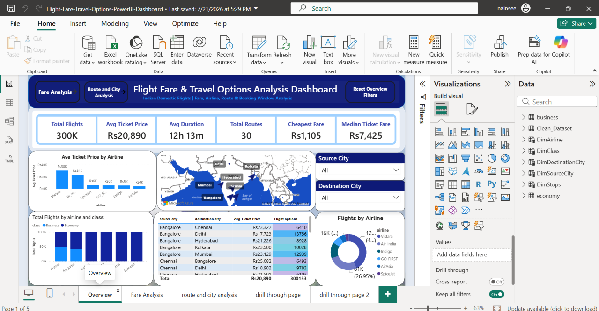
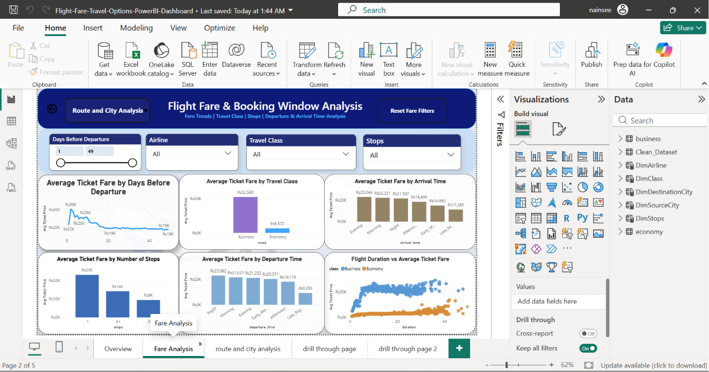
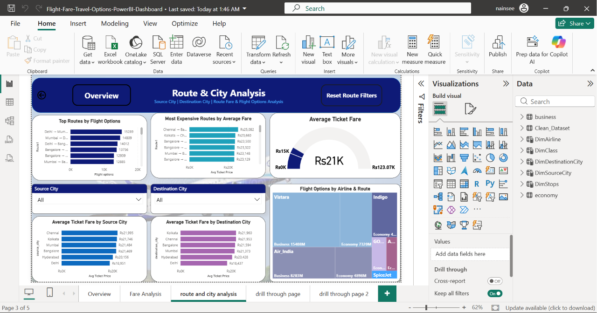
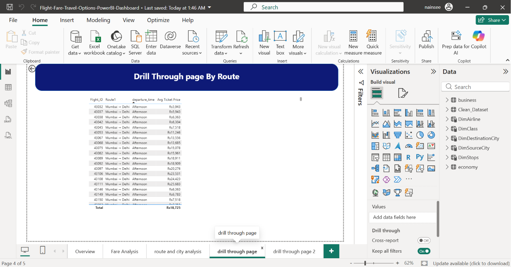
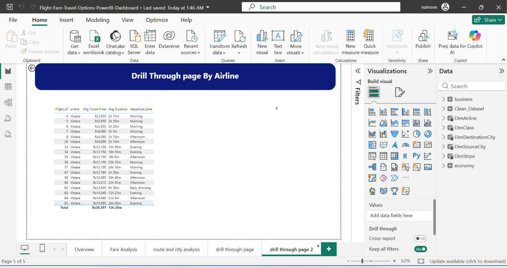

# ✈️ Flight Fare & Travel Options Analysis Dashboard

An interactive Business Intelligence dashboard developed using **Microsoft Power BI** to analyze historical Indian domestic flight fares and travel options.

## 📌 Project Overview

This project analyzes more than **300,000 flight-option records** to understand how different factors influence ticket fares, including:

- Airline
- Source and destination city
- Travel class
- Booking window
- Number of stops
- Flight duration
- Departure and arrival time

The dashboard converts raw flight data into interactive and meaningful insights that can help users compare airlines, routes and fare patterns.

## 📊 Dashboard Pages

### 1. Overview Dashboard

Provides a high-level summary of:

- Total flight options
- Average ticket fare
- Average flight duration
- Total routes
- Cheapest fare
- Median ticket fare

### 2. Fare Analysis

Analyzes how ticket fares are affected by:

- Days before departure
- Airline
- Travel class
- Number of stops
- Departure and arrival time
- Flight duration

### 3. Route & City Analysis

Provides insights into:

- Top routes by flight options
- Most expensive routes
- Source and destination city fares
- Airline and route distribution
- Average fare benchmark

### 4. Route Drill-through

Displays detailed fare records for a selected route.

### 5. Airline Drill-through

Displays detailed fare and duration records for a selected airline.

## 🛠️ Tools and Techniques

- Microsoft Power BI
- Power Query
- DAX Measures
- Calculated Columns
- Star Schema Data Modeling
- One-to-Many Relationships
- Interactive Slicers
- KPI Cards
- Bookmarks and Reset Filters
- Page Navigation
- Drill-through Analysis
- Cross-filtering and Tooltips

## 🔍 Key Insights

- Business Class fares are significantly higher than Economy Class fares.
- Ticket fares generally decrease when flights are booked earlier.
- Airline, route, class, stops and travel timings influence ticket prices.
- Different cities and routes show different fare and flight-option patterns.
- Travellers can compare airlines and booking windows to identify economical options.

## 🗂️ Data Model

The project uses a star-schema model with `Clean_Dataset` as the central fact table and separate dimension tables for:

- Airline
- Travel Class
- Source City
- Destination City
- Stops

## 📥 Download the Project

[Download the Power BI Dashboard](./Flight-Fare-Travel-Options-PowerBI-Dashboard.pbix)

Download the `.pbix` file and open it using **Microsoft Power BI Desktop**.

## 👥 Project Team

- Nainsee
- Muskan

## 📚 Data Source

Publicly available historical Indian domestic flight-fare dataset containing more than 300,000 flight-option records.

## ⚠️ Disclaimer

This project was developed for educational and analytical purposes. The dataset contains historical flight-fare information and does not represent live ticket prices or confirmed passenger bookings.
